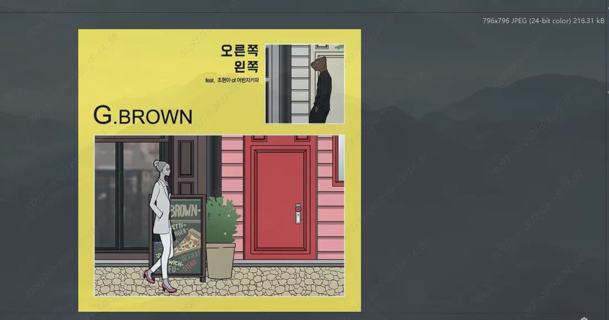

   

# Android Bitmap 全面详解

明确整理这篇博客的目的：

1. 对自己了解的bitmap知识做一个梳理；
2. 进一步了解OOM；
3. 主要对是介绍怎么使用bitmap，可能会对部分重要的方法进行源码的解读

## 一.Bitmap的定义

Bitmap是Android系统中的图像处理的最重要类之一。用它可以获取图像文件信息，进行图像剪切、旋转、缩放等操作，并可以指定格式保存图像文件。

首先让我们开始对一张图片转化成Bitmap 后，占用内存分析，开始这次的技术总结：

```java
        Bitmap bitmap = BitmapFactory.decodeResource(getResources(), R.drawable.img3);
        binding.image.setImageBitmap(bitmap);
        Log.d(TAG, "onCreate: "+bitmap.getAllocationByteCount());
```

我们可以通过 Bitmap.getAllocationByteCount() 方法获取 Bitmap 占用的字节大小

```java
D/路茜: onCreate: 2534464
```

我在drawablewe文件夹下保存的是一张796*796的图片



**解释**：

默认情况下 BitmapFactory 使用 Bitmap.Config.ARGB_8888 的存储方式来加载图片内容，而在这种存储模式下，每一个像素需要占用 4 个字节。因此上面图片 rodman 的内存大小可以使用如下公式来计算：

> 796 * 796 * 4= 2,534,464 bity=2.4 MB

原本就216kb的图片转化成bitmap之后竟然就有2.4MB，那么当我们加载很多图片的时候，就不奇怪为什么程序会奔溃了！！是我我也奔溃，自己写出来什么垃圾。

上面的引入，可以看出使用bitmap的两个需要的常规操作：对像素点的存储、对图片的压缩。

## 二.Bitmap的格式

我们知道`Bitmap`是位图，是由像素点组成的，这就涉及到两个问题，

- **第一：如何存储每个像素点？**
- **第二：怎么压缩像素点？**

Bitmap 中有两个内部枚举类：

> `Config` 和 `CompressFormat`，`Config` 是用来设置颜色配置信息的，`CompressFormat` 是用来设置压缩方式的


### 2.1 存储格式

`Bitmap`有常见的有前面四种存储方式，对应`Bitmap.Config`中的四个常量


## 2.2 压缩格式

> **Bitmap.CompressFormat.JPEG**:采用JPEG压缩算法，是一种有损压缩格式，会在压缩过程中改变图像原本质量，画质越差，对原来的图片质量损伤越大，但是得到的文件比较小，而且JPEG不支持透明度，当遇到透明度像素时，会以黑色背景填充。


> **Bitmap.CompressFormat.PNG**:采用PNG算法，是一种支持透明度的无损压缩格式。


> **Bitmap.CompressFormat.WEBP**:WEBP是一种同时提供了有损压缩和无损压缩的图片文件格式，在14<=api<=17时，WEBP是一种有损压缩格式，而且不支持透明度，在api18以后WEBP是一种无损压缩格式，而且支持透明度，有损压缩时，在质量相同的情况下，WEBP格式的图片体积比JPEG小40%，但是编码时间比JPEG长8倍。在无损压缩时，无损的WEBP图片比PNG压缩小26%，但是WEBP的压缩时间是PNG格式压缩时间的5倍。


