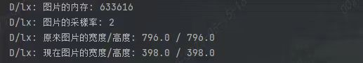
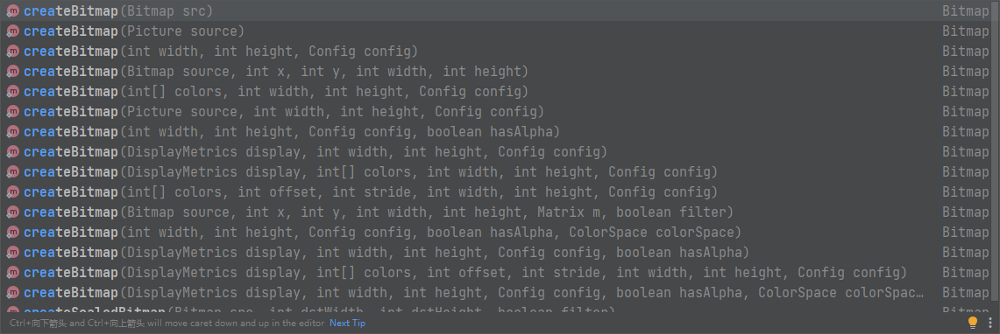

# BitMap的基本使用

我们创建一个BItMap有几种方式？

答：两种：一种是使用**BitmapFactory**类去加载，另一种是使用**Bitmap类**加载。

## 一、BitmapFactory


### 1.1 **BitmapFactory提供了多种创建bitmap的静态方法**

```java
//从资源文件中通过id加载bitmap
//Resources res:资源文件，可以context.getResources()获得
//id:资源文件的id，如R.drawable.xxx
public static Bitmap decodeResources(Resources res,int id)
//第二种只是第一种的重载方法，多了个Options参数
public static Bitmap decodeResources(Resources res,int id,Options opt)

```

```java
//传入文件路径加载，比如加载sd卡中的文件
//pathName:文件的全路径名
public static Bitmap decodeFile(String pathName);
public static Bitmap decodeFile(String pathName,Options opt);

```

```java
//从byte数组中加载
//offset:对应data数组的起始下标
//length:截取的data数组的长度
public static Bitmap decodeByteArray(byte[] data,int offset , int length);
public static Bitmap decodeByteArray(byte[] data,int offset , int length,Options opt);

```

```java
//FileDescriptor :包含解码位图的数据文件的路径
//通过该方式从路径加载bitmap比decodeFile更节省内存，原因不解释了。
public static Bitmap decodeFileDescriptor(FileDescriptor fd);
public static Bitmap decodeFileDescriptor(FileDescriptor fd,Rect outPadding,Options opt);

```

decodeFile、 decodeResource、decodeStream和decodeByteArray,分别用于支持从文件系统、资源、输入流以及字节数组中加载出一个Bitmap对象，其中decodeFile和decodeResource又间接调用了decodeStream方法，这四类方法最终是在Android的底层实现的，对应着BitmapFactory类的几个native 方法。

> 一个native方法就是一个Java调用非Java代码的接口。一个native方法是指该方法的实现由非Java语言实现，比如用C或C++实现。

### 1.2 Bitmap.Options

想要创建一个`Bitmap`有很多种方法，其中很多方法都要求传入一个`Bitmap.Options`，它是什么呢，有什么作用呢？

这个参数的作用非常大，他可以设置Bitmap的**采样率**，通过改变图片的宽度高度和缩放比例等，以达到**减少图片像素数的目的**，一言以蔽之，通过设置这个参数我们可以很好的控制显示和使用`Bitmap`。实际开发过程中，可以灵活设置该值，以降低`OOM`发生的概率。

1. 如何高效地加载bitmap?

通过`BitmapFactory.Options`按一定的`采样率`来加载缩小后的图片，将缩小后的图片在`ImageView`中显示，这样就会降低内存占用从而在一定程度上避免OOM，提高了Bitmap 加载时的性能。BitmapFactory提供的加载图片的四类方法都支持BitmapFactory.Options参数

2. 通过BitmapFactory.Options 来缩放图片，主要用到了inSampleSize参数，即采样率。

当inSampleSize为1时，采样后的图片大小为图片的原始大小;
当inSampleSize大于1时，比如为2,那么采样后的图片其宽/高均为原图大小的1/2,而像素数为原图的1/4,其占有的内存大小也为原图的1/4。

> 拿一张1024×1024像素的图片来说，假定采用ARGB8888格式存储，那么它占有的内存为1024×1024×4即4MB，如果inSampleSize为2，那么采样后的图片其内存占用只有512×512×4，即1MB。

采样率同时作用于宽/高，这将导致缩放后的图片大小以采样率的2次方形式递减，即缩放比例为1/ (inSampleSize的2次方)

​		比如inSampleSize为4,那么缩放比例就是1/16。
​		有一种特殊情况，那就是当inSampleSize 小于1时，其作用相当于1,即无缩放效果。

**参数说明：**


举例说明：

```java
BitmapFactory.Options options = new BitmapFactory.Options();
// 设置inJustDecodeBounds为true后，再使用decodeFile()等方法，并不会真正的分配空间，
//即解码出来的Bitmap为null，但是可计算出原始图片的宽度和高度，即options.outWidth和options.outHeight
options.inJustDecodeBounds = true;
BitmapFactory.decodeResource(getResources(), R.drawable.img3, options);
float  srcWidth = options.outWidth;
float  srcHeight = options.outHeight;
int inSampleSize = 1;
float  height = 100;
float  width = 528;

if (srcHeight > height || srcWidth > width) {
    if (srcWidth > srcHeight) {
        inSampleSize = Math.round(srcHeight / height);
    } else {
        inSampleSize = Math.round(srcWidth / width);
    }
}

options.inJustDecodeBounds = false;
options.inSampleSize = inSampleSize;

Bitmap bitmap = BitmapFactory.decodeResource(getResources(), R.drawable.img3, options);
float  outWidth = options.outWidth;
float  outHeight = options.outHeight;
binding.image.setImageBitmap(bitmap);


Log.d(TAG, "图片的内存: " + bitmap.getAllocationByteCount());
Log.d(TAG, "图片的采樣率: " + inSampleSize);
Log.d(TAG, "原來图片的宽度/高度: " + srcWidth + " / " + srcHeight);
Log.d(TAG, "現在图片的宽度/高度: " + outWidth + " / " + outHeight);
```



## 二. Bitmap静态方法

```java
//width和height是长和宽单位px,config是存储格式
static Bitmap createBitmap(int width , int height Bitmap.Config config)
// 根据一幅图像创建一份一模一样的实例
static Bitmap createBitmap(Bitmap bm)
//截取一幅bitmap，起点是（x，y）,width和height分别对应宽高
static Bitmap createBitmap(Bitmap bm,int x,int y,int width,int height)
//比上面的裁剪函数多了两个参数，Matrix:给裁剪后的图像添加矩阵 boolean filter:是否给图像添加滤波效果
static Bitmap createBitmap(Bitmap bm,int x,int y,int width,int height，Matrix m,boolean filter);
//用于缩放bitmap,dstWidth和dstHeight分别是目标宽高
createScaledBitmap(Bitmap bm,int dstWidth,int dstHeight,boolean filter)
```



**这些方法大致可以分为三类：**

- 1、根据已有的Bitmap来创建新Bitmap

```java
/**
* 通过矩阵的方式，返回原始 Bitmap 中的一个不可变子集。新 Bitmap 可能返回的就是原始的 Bitmap，也可能还是复制出来的。
* 新 Bitmap 与原始 Bitmap 具有相同的密度（density）和颜色空间;
*
* @param source   原始 Bitmap
* @param x        在原始 Bitmap 中 x方向的其起始坐标（你可能只需要原始 Bitmap x方向上的一部分）
* @param y        在原始 Bitmap 中 y方向的其起始坐标（你可能只需要原始 Bitmap y方向上的一部分）
* @param width    需要返回 Bitmap 的宽度（px）（如果超过原始Bitmap宽度会报错）
* @param height   需要返回 Bitmap 的高度（px）（如果超过原始Bitmap高度会报错）
* @param m        Matrix类型，表示需要做的变换操作
* @param filter   是否需要过滤，只有 matrix 变换不只有平移操作才有效
*/
public static Bitmap createBitmap(@NonNull Bitmap source, int x, int y, int width, int height,
            @Nullable Matrix m, boolean filter) 


```

- 2、通过像素点数组创建空的Bitmap

```java
/**
     * 
     * 返回具有指定宽度和高度的不可变位图，每个像素值设置为colors数组中的对应值。
     * 其初始密度由给定的确定DisplayMetrics。新创建的位图位于sRGB 颜色空间中。
     * @param display  显示将显示此位图的显示的度量标准
     * @param colors   用于初始化像素的sRGB数组
     * @param offset   颜色数组中第一个颜色之前要跳过的值的数量
     * @param stride   行之间数组中的颜色数（必须> = width或<= -width）
     * @param width    位图的宽度
     * @param height   位图的高度
     * @param config   要创建的位图配置。如果配置不支持每像素alpha（例如RGB_565），
     * 那么colors []中的alpha字节将被忽略（假设为FF）
     */
    public static Bitmap createBitmap(@NonNull DisplayMetrics display,
            @NonNull @ColorInt int[] colors, int offset, int stride,
            int width, int height, @NonNull Config config) 


```

- 3、 创建缩放的Bitmap

```java
/**
* 对Bitmap进行缩放，缩放成宽 dstWidth、高 dstHeight 的新Bitmap
*/
public static Bitmap createScaledBitmap(@NonNull Bitmap src, int dstWidth, int dstHeight,boolean filter)

```

## 三.创建Bitmap的总结

1. 加载图像可以使用BitmapFactory和Bitmap.create系列方法
2. 可以通过Options实现缩放图片，获取图片信息，配置缩放比例等功能
3. 如果需要裁剪或者缩放图片，只能使用create系列函数
4. 注意加载和创建bitmap事通过try catch捕捉OOM异常
